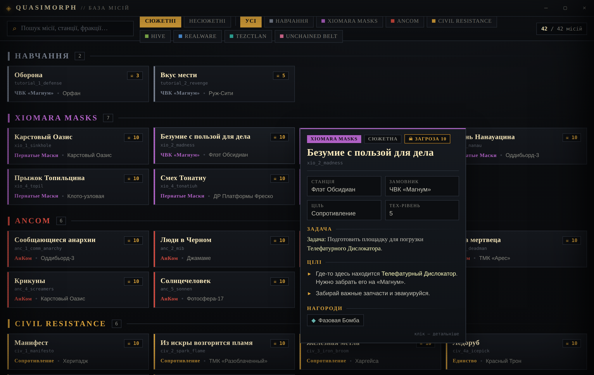

# Quasimorph Companion

A desktop mission database for the roguelike **Quasimorph**, styled to look like the game itself.
It lists **every mission in the game** — story missions and procedural (non‑story) missions, including
hidden ones — and shows a game‑like mission card on hover with the full briefing, objectives, stages,
rewards, factions and station.

> UI language: **Ukrainian**. Mission texts: **Russian** (the game has no Ukrainian localization; Russian
> is the closest available in‑game language). All data is extracted directly from the local game files.



## Features

- **313 missions** total — 42 story missions + 271 procedural missions.
- Three views: **Story** (grouped by campaign), **Procedural** (grouped by mission type), and
  **Chain** — a per‑campaign story timeline showing mission order, mutually‑exclusive branches and
  unlock conditions (reconstructed from the game's questline / strategy data).
- Story missions grouped by campaign (AnCom, Civil Resistance, Hive, RealWare, Tezctlan, Xiomara Masks,
  Unchained Belt, Tutorial), colour‑coded per faction.
- Non‑story missions grouped by type (Захват, Оборона, Устранение, Саботаж, Шпионаж, Ритуал, …).
- **Hover** a mission to open a compact mission card; **click** to open the full detail panel with
  briefing, details, objectives, stages, rewards and epilogue.
- Authentic **game sprites** for factions and mission types (tiles, cards, chain nodes), with hand‑drawn
  SVG fallbacks if the sprites are not present.
- In‑game highlight colour (`#FFFEC1`) is preserved in all texts.
- Instant search across mission name, id, station and factions.
- Frameless, game‑styled window (dark palette, scanline / vignette atmosphere).
- **Offline fonts**: Oswald / PT Sans Narrow / JetBrains Mono are bundled locally as woff2 during
  `npm install` (postinstall) — no CDN dependency at runtime.

## Tech

- **Electron** (HTML/CSS/JS, no build step required to run).
- Mission data is bundled as `data/missions.json`, extracted from
  `Quasimorph/Quasimorph_Data/resources.assets` (the game's sectioned TSV database + localization table).

## Run

```bash
npm install
npm start
```

## Build a Windows installer

```bash
npm run dist
```

The installer is produced in `dist/`.

## Data regeneration

`data/missions.json` is generated from the game's `resources.assets`. See `tools/extract_missions.py`
(the extractor script) to regenerate it against a newer game version.

## Icons

Faction emblems, mission‑type glyphs and campaign portraits are authentic game sprites — but they are
**not tracked in this repository** (they are game‑publisher assets). `src/icons.js` prefers a real PNG
under `assets/game-icons/` and falls back to a hand‑drawn SVG placeholder (via the `` `onerror`
handler) whenever a sprite is missing, so the app looks fine either way.

To activate the real sprites on your own machine:

```bash
pip install UnityPy Pillow
python tools/extract_icons.py "<path>/Quasimorph/Quasimorph_Data"
```

Then re‑run the extractor with keywords (e.g. `_missionicon_ _tooltip _tooltype _small`) to export the
PNGs into `assets/game-icons/`. The folder is gitignored, so nothing you export leaks into commits.

## License

MIT
